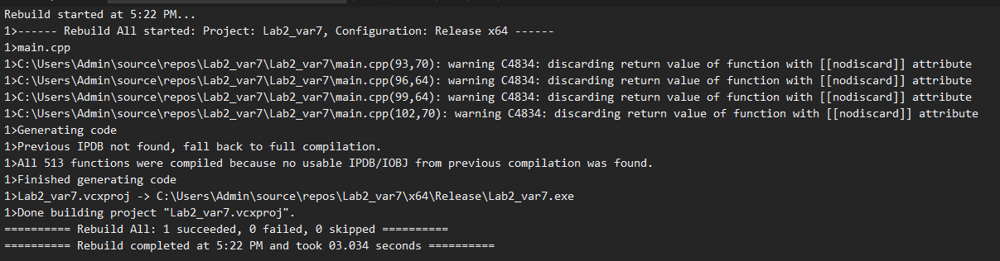
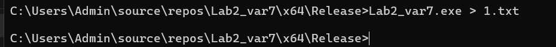

# Лабораторна робота: Дослідження продуктивності std::none_of

## Звіт з дослідження

### Мета
Дослідити продуктивність послідовного, стандартного паралельного (`std::execution`) та власного паралельного (`std::thread`) виконання алгоритму `std::none_of` на даних розміром 1, 10 та 50 млн елементів. Тестування проводилось на C++20 (MSVC) на машині з 16 логічними ядрами.

---

### Ключові результати
Найвища продуктивність на всіх наборах даних була досягнута за допомогою стандартної політики `std::execution::par_unseq`. Власна реалізація була менш ефективною.

| Розмір даних   | Найкращий стандартний (`par_unseq`) | Найкращий власний алгоритм | Оптимальне K |
| :------------- | :---------------------------------- | :------------------------- | :----------- |
| **1 млн** | **0.1089 мс** | 0.4782 мс                  | 6            |
| **10 млн** | **1.0864 мс** | 2.2205 мс                  | 31           |
| **50 млн** | **5.9850 мс** | 8.9852 мс                  | 16           |

---

### Висновки
1.  **Стандартні політики є найефективнішими.** Вбудовані в C++ паралельні алгоритми значно перевершують власну реалізацію на `std::thread`.
2.  **Оптимальна кількість потоків ($K$) залежить від задачі.** Для великих даних вона наближається до кількості апаратних ядер (16).
3.  **Надлишкові потоки шкодять продуктивності.** Коли $K$ значно перевищує кількість ядер, час виконання зростає.

---

##  Скріншоти результатів

### Успішна компіляція (Release x64)

### Виконання програми та перенаправлення виводу

### Повний вивід програми можна переглянути у файлі: [1.txt](1.txt)
